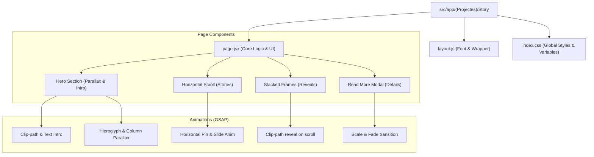

# Story Project: Comprehensive Developer Guide

Welcome to the **Story** project developer guide. This document provides an in-depth look at the architecture, animation logic, and data structures used to create the immersive Egyptian Museum experience.

## 🗺️ Project Minmap (Structure)



---

## 🚀 Core Technologies

- **Next.js (App Router)**: Handles routing and provides the React environment.
- **GSAP (GreenSock Animation Platform)**: The core engine for all visual transitions.
  - **ScrollTrigger**: The most critical plugin, linking animations to scroll progress.
  - **SplitText**: Used for character-by-character or line-by-line text reveals.
  - **TextPlugin**: Enables the "typing" effect seen in the hero section.
  - **useGSAP**: A specialized hook that handles animation lifecycle (initialization and cleanup) within React components.
- **Tailwind CSS**: Provides utility classes for layout, spacing, and basic styling.
- **Vanilla CSS**: Used for complex animations and design tokens in `index.css`.

---

## 🛠️ How It Works: Section by Section

### 1. Hero Section (The Intro)

- **Logic**: Uses a GSAP timeline (`introTL`) that runs once on mount.
- **Key Animation**: `clipPath: "inset(50% 20% 50% 20%)"` to `inset(0% 0% 0% 0%)` creates the opening "shutter" effect.
- **Parallax**: The `HeroTl` timeline uses `scrub: 1` to link the movement of background columns (`column-1`, `column-2`) and hieroglyphs to the scroll position.

### 2. Horizontal Scroll (The Stories)

- **Logic**: The entire `.horizontal-section` is "pinned" using ScrollTrigger.
- **Mechanism**: The `xPercent` property moves the slides container horizontally based on the vertical scroll distance.
- **Inner Animations**: Each slide has its own `ScrollTrigger` with `containerAnimation: HS`, allowing elements _inside_ the horizontal scroll to animate as they become visible.

### 3. Stacked Frames (The Reveal)

- **Logic**: Frames are stacked using `zIndex`.
- **Animation**: The `clipPath` property is animated from `inset(0 0 100% 0)` (hidden) to `inset(0 0 0 0)` (visible).
- **Effect**: This creates a "sliding window" reveal where each new section appears to grow from the bottom.

### 4. Read More Modal (The Detail)

- **State**: Controlled by `selectedStory` (React `useState`).
- **Animations**:
  - **Open**: `gsap.fromTo` on `.modal-overlay` (fade) and `.modal-content` (scale + slide).
  - **Close**: `gsap.to` with an `onComplete` callback to clear the state after the animation finishes.

---

## 📊 Data Structure: `Texts` Array

The content for the horizontal slides and the modal is driven by the `Texts` array in `page.jsx`.

```javascript
{
  chapter: "الرواية الأولى",
  title: "كنوز توت عنخ آمون",
  text: "Short summary for the slide...",
  img: "/path/to/image.jpg",
  details: "Longer description for the modal..."
}
```

### How to add a new story:

1.  Add a new object to the `Texts` array.
2.  Ensure the image exists in the `public/` directory.
3.  The horizontal scroll logic will automatically adjust its width to accommodate the new slide.

---

## 🎨 Styling & Design Tokens

Check `index.css` for the project's visual foundation:

- **Fonts**: `--font-heading` (Cinzel) and `--font-body` (Outfit).
- **Colors**: Deep blacks (`#0a0a0a`) and amber/gold accents (`#d97706`).
- **Glassmorphism**: Used in the modal for a premium, modern feel.

---

## 💡 Development Tips

- **ScrollTrigger Markers**: Enable `markers: true` in the `ScrollTrigger` configuration to debug start/end points.
- **SSR Safety**: Always check `if (typeof window === "undefined") return;` inside `useGSAP` to prevent errors during server-side rendering.
- **Cleanup**: The `useGSAP` hook automatically handles animation cleanup, preventing memory leaks and duplicate triggers.

---

> [!IMPORTANT]
> When modifying animations, ensure that the `trigger` element has a defined height or width, as GSAP relies on these dimensions to calculate scroll progress.
